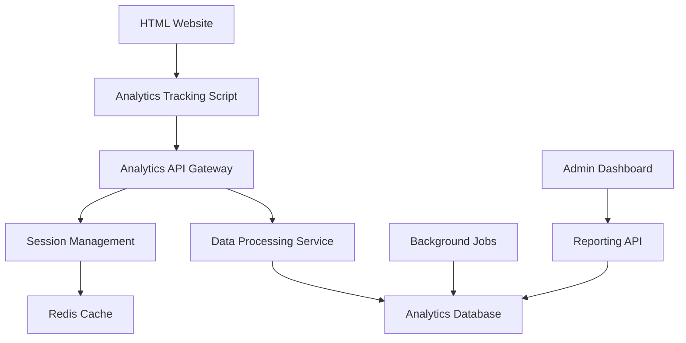

# Design Document

## Overview

The website analytics tracking system consists of a lightweight client-side tracking script embedded in HTML pages and a robust backend API for data collection, storage, and processing. The design maintains the HTML-only frontend requirement while providing comprehensive analytics capabilities through minimal JavaScript injection and server-side tracking fallbacks.

## Architecture

### High-Level Architecture



### System Components

1. **Client-Side Tracking Layer**
   - Minimal JavaScript tracker (~5KB compressed)
   - Pixel tracking fallback for no-JS scenarios
   - Local storage for session persistence

2. **API Gateway**
   - Express.js server handling analytics endpoints
   - Rate limiting and request validation
   - CORS configuration for cross-origin requests

3. **Data Processing Pipeline**
   - Real-time event processing
   - Data validation and sanitization
   - Batch processing for aggregations

4. **Storage Layer**
   - PostgreSQL for structured analytics data
   - Redis for session caching and real-time metrics
   - File storage for large datasets (optional)

## Components and Interfaces

### Client-Side Tracker

**Core Tracking Script (`analytics.js`)**
```javascript
// Minimal interface for tracking events
window.analytics = {
  track: (event, properties) => {},
  page: (url, properties) => {},
  identify: (userId, traits) => {},
  init: (config) => {}
};
```

**Tracking Capabilities:**
- Page views with full URL including hash fragments
- Click events with element selectors and coordinates
- Scroll depth tracking (25%, 50%, 75%, 100%)
- Time on page and session duration
- Browser fingerprinting for unique visitor identification
- Cookie-based visitor identification for repeat visitor tracking
- Hash change detection for SPA-like navigation

**No-JavaScript Fallback:**
- 1x1 pixel tracking images with encoded parameters
- Server-side log parsing for basic analytics
- Form submission tracking via hidden fields

### Backend API Endpoints

**Data Collection Endpoints:**
```
POST /api/track/event     - Track custom events
POST /api/track/page      - Track page views
POST /api/track/batch     - Batch event submission
GET  /api/track/pixel     - Pixel tracking fallback
```

**Session Management:**
```
POST /api/session/start   - Initialize new session
PUT  /api/session/update  - Update session data
POST /api/session/end     - End session
```

**Analytics Retrieval:**
```
GET  /api/analytics/summary    - Dashboard summary data
GET  /api/analytics/events     - Event data with filtering
GET  /api/analytics/sessions   - Session analytics
GET  /api/analytics/realtime   - Real-time visitor data
```

### Data Processing Service

**Event Processing Pipeline:**
1. **Ingestion Layer** - Receives and validates incoming events
2. **Enrichment Layer** - Adds geographic data, device info, referrer parsing
3. **Storage Layer** - Persists events to database with proper indexing
4. **Aggregation Layer** - Real-time metric calculations and caching

**Background Job Processing:**
- Hourly aggregation jobs for performance metrics
- Daily reports generation
- Data cleanup and archival processes
- Geographic IP resolution and caching

## Data Models

### Event Schema
```sql
CREATE TABLE analytics_events (
  id UUID PRIMARY KEY DEFAULT gen_random_uuid(),
  session_id VARCHAR(255) NOT NULL,
  event_type VARCHAR(100) NOT NULL,
  url TEXT NOT NULL,
  url_hash VARCHAR(255),
  referrer TEXT,
  user_agent TEXT,
  ip_address INET,
  timestamp TIMESTAMP WITH TIME ZONE DEFAULT NOW(),
  properties JSONB,
  created_at TIMESTAMP WITH TIME ZONE DEFAULT NOW()
);
```

### Session Schema
```sql
CREATE TABLE analytics_sessions (
  id VARCHAR(255) PRIMARY KEY,
  visitor_id VARCHAR(255),
  cookie_id VARCHAR(255),
  start_time TIMESTAMP WITH TIME ZONE,
  end_time TIMESTAMP WITH TIME ZONE,
  page_views INTEGER DEFAULT 0,
  duration_seconds INTEGER,
  browser_fingerprint VARCHAR(255),
  device_info JSONB,
  geographic_data JSONB,
  is_returning_visitor BOOLEAN DEFAULT FALSE,
  created_at TIMESTAMP WITH TIME ZONE DEFAULT NOW()
);
```

### Visitor Schema
```sql
CREATE TABLE analytics_visitors (
  id VARCHAR(255) PRIMARY KEY,
  cookie_id VARCHAR(255) UNIQUE,
  first_visit TIMESTAMP WITH TIME ZONE,
  last_visit TIMESTAMP WITH TIME ZONE,
  total_sessions INTEGER DEFAULT 1,
  total_page_views INTEGER DEFAULT 0,
  browser_fingerprint VARCHAR(255),
  created_at TIMESTAMP WITH TIME ZONE DEFAULT NOW()
);
```

### Page Views Schema
```sql
CREATE TABLE analytics_page_views (
  id UUID PRIMARY KEY DEFAULT gen_random_uuid(),
  session_id VARCHAR(255) REFERENCES analytics_sessions(id),
  url TEXT NOT NULL,
  url_hash VARCHAR(255),
  title VARCHAR(500),
  load_time INTEGER,
  scroll_depth INTEGER,
  time_on_page INTEGER,
  exit_page BOOLEAN DEFAULT FALSE,
  timestamp TIMESTAMP WITH TIME ZONE DEFAULT NOW()
);
```

## Error Handling

### Client-Side Error Handling
- Graceful degradation when analytics service is unavailable
- Retry logic with exponential backoff for failed requests
- Local storage queuing for offline scenarios
- Error logging without affecting main website functionality

### Server-Side Error Handling
- Request validation with detailed error responses
- Database connection pooling and failover
- Rate limiting to prevent abuse
- Comprehensive logging and monitoring

### Data Integrity
- Event deduplication using client-generated UUIDs
- Schema validation for all incoming data
- Data sanitization to prevent XSS and injection attacks
- Backup and recovery procedures for analytics data

## Testing Strategy

### Unit Testing
- Client-side tracker functionality testing
- API endpoint testing with various payloads
- Data model validation and constraint testing
- Background job processing verification

### Integration Testing
- End-to-end tracking flow from client to database
- Cross-browser compatibility testing
- Performance testing under high load
- Privacy compliance validation

### Performance Testing
- Load testing for high-traffic scenarios
- Database query optimization validation
- Client-side script performance impact measurement
- API response time benchmarking

### Security Testing
- Input validation and sanitization testing
- CORS policy verification
- Rate limiting effectiveness testing
- Data encryption and privacy compliance validation

## Implementation Considerations

### Privacy and Compliance
- GDPR compliance with data anonymization
- Cookie-based visitor tracking with proper consent mechanisms
- Browser fingerprinting as fallback for cookie-disabled users
- Opt-out mechanisms and do-not-track respect
- Data retention policies and automated cleanup

### Performance Optimization
- Asynchronous script loading to prevent blocking
- CDN distribution for global performance
- Database indexing strategy for fast queries
- Caching layers for frequently accessed data

### Scalability
- Horizontal scaling capabilities for API servers
- Database sharding strategies for large datasets
- Message queue integration for high-volume processing
- Auto-scaling based on traffic patterns

### Monitoring and Alerting
- Real-time monitoring of tracking script performance
- Database performance and query optimization alerts
- API endpoint health checks and uptime monitoring
- Data quality monitoring and anomaly detection